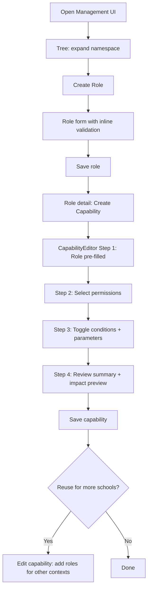
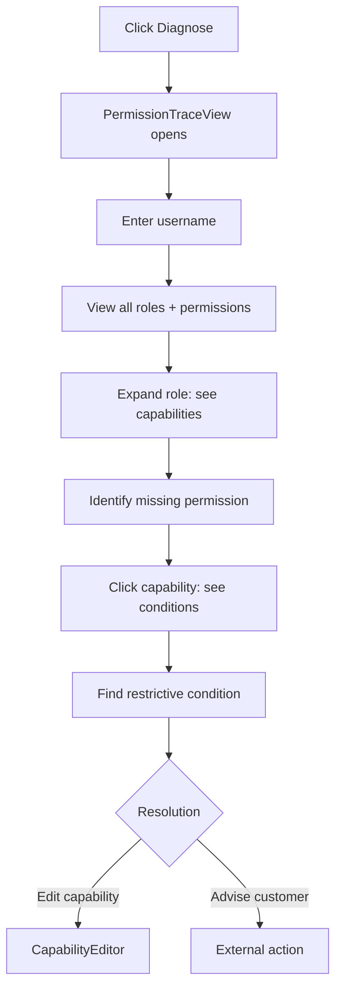
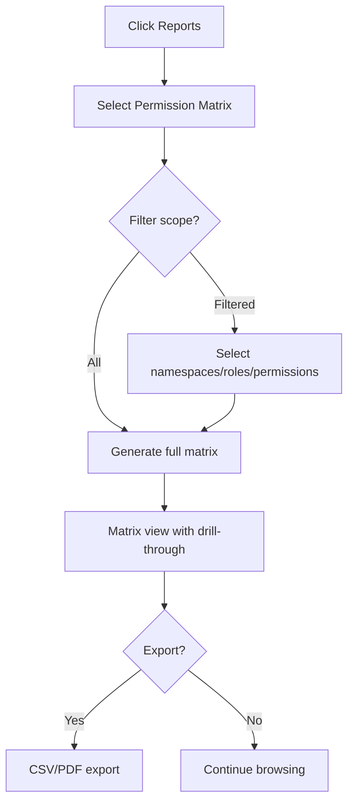
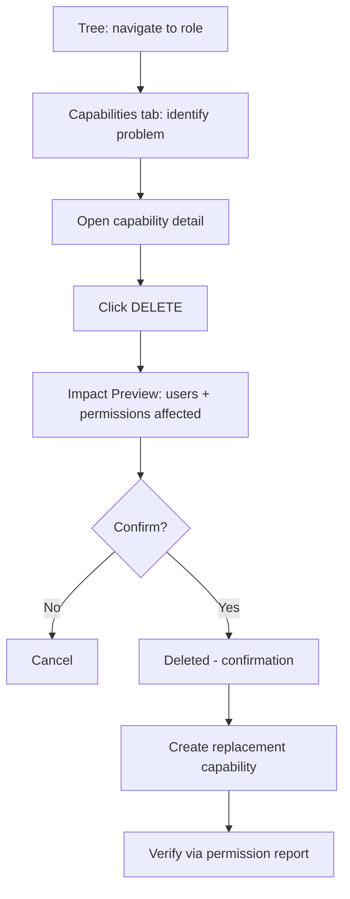

# UX Design Specification Guardian

**Author:** Nubus Core team
**Date:** 2026-04-03

---

<!-- UX design content will be appended sequentially through collaborative workflow steps -->

## Executive Summary

### Project Vision

Guardian's Management UI evolves from a functional CRUD interface into an authorization management platform that makes ABAC policies transparent, safe to modify, and auditable. The UX must compress the inherent complexity of attribute-based access control into workflows that feel natural to school district sysadmins, while simultaneously serving the diagnostic needs of support engineers and the reporting needs of CISOs. This is a brownfield evolution -- every design decision builds on the existing Vue 3 SPA, the Univention VEB component library, and the established hexagonal architecture patterns.

### Target Users

**Primary -- Markus (School District Sysadmin):** Manages delegated administration across multiple schools. Competent but not deeply technical. Creates roles, assigns capabilities, verifies permissions. Needs to work quickly and with confidence that mistakes are recoverable. Uses the Management UI daily. **Markus's daily capability management workflow is the explicit primary design target.** All core UX decisions optimize for his experience first.

**Secondary -- Claudia (Support Engineer):** Diagnoses authorization issues remotely. Needs the full permission chain (role -> capability -> condition -> permission) visible per user. Primarily uses CLI, but also the Management UI for visual investigation. Her diagnostic features are designed *after* the primary workflow is solid, leveraging the same underlying permission chain visibility patterns.

**Secondary -- Stefan (CISO):** Audits cross-namespace permissions for compliance. Reads, filters, and exports permission reports. Does not configure -- he verifies. Uses the Management UI's reporting features periodically. His compliance reporting features share the same data patterns as Claudia's diagnostics but are lower priority in the design sequence.

**Note:** Application developers (Jaime) and SaaS DevOps engineers (Nadia) interact exclusively through API and CLI. Their UX needs are addressed by API design and documentation, not by the Management UI, and are therefore excluded from this UX specification.

### Key Design Challenges

1. **Complexity Compression:** Making the ABAC domain model (namespaced entities, capabilities with conditional permissions, context-scoped roles) understandable to non-technical administrators through progressive disclosure and natural-language framing.

2. **Permission Chain Visibility:** Building end-to-end visibility into the authorization chain (role -> capability -> conditions -> permissions) for both per-user diagnostics and cross-namespace compliance reporting, without overwhelming either use case. This is the shared pattern underlying both Claudia's and Stefan's secondary features.

3. **Safe Destructive Actions:** Designing DELETE operations for all entity types with impact preview (blast radius visualization) and clear referential integrity feedback. **Technical dependency:** DELETE validation endpoints MUST return affected entity counts and dependency graphs in their responses -- the UI should not assemble blast radius data from multiple client-side API calls.

4. **Multi-Role Capability Model:** Transitioning the UI's mental model from capabilities-as-properties-of-roles to capabilities-as-reusable-building-blocks. The current generic EditView (992 lines) is already at its complexity limit. **Recommendation:** A dedicated CapabilityEditor component should replace the generic EditView for capability management, as capabilities are the heart of the system and warrant specialized treatment.

5. **Brownfield Integration:** All new features must integrate with the existing Vue 3 SPA, Univention VEB component library, generic ListView/EditView patterns (except where explicitly superseded, e.g., CapabilityEditor), Stylus styling, i18n (English + German), and established route structures.

6. **Testable Referential Integrity:** UX designs for destructive actions must be grounded in testable scenarios with deep referential chains (e.g., namespace containing roles used in capabilities that reference conditions from other namespaces). This is a design constraint, not just an implementation detail.

7. **Real-Time Consistency:** The multi-role capability editor must handle edge cases where referenced entities (roles, conditions, permissions) are modified or deleted by another user while the form is being edited. Optimistic concurrency or refresh-on-save patterns must be considered.

### Design Opportunities

1. **Per-User Permission Map:** A visual, searchable permission query that turns Guardian's opaque ABAC engine into a transparent, trustworthy system. No competing product offers this out of the box. **Technical dependency:** This requires a new API endpoint (no existing endpoint returns "all permissions for an actor across all targets"). The UX spec defines the ideal experience; the backend contract will be designed to match. This is framed as a design aspiration with explicit API dependency, not an assumed capability.

2. **Impact Preview for Destructive Actions:** Live blast-radius visualization before DELETE or modification, showing affected users, roles, and capabilities. Transforms error recovery from a stressful exercise into informed decision-making. Depends on the backend returning dependency data in DELETE validation responses (see Challenge 3).

3. **Progressive Disclosure for Capability Editing:** Guide administrators through capability creation with natural-language steps rather than exposing the full ABAC data model simultaneously. The dedicated CapabilityEditor component (see Challenge 4) is the natural home for this pattern.

4. **CISO Compliance Report as Trust Artifact:** A clean, exportable permission matrix that serves both compliance auditors and sales demonstrations. Secondary priority, designed after Markus's primary workflow is solid.

## Core User Experience

### Defining Experience

The core user action in Guardian's Management UI is **capability management** -- creating and editing the mappings that wire roles to permissions under conditions. This is what Markus does daily, and it is the interaction that must feel effortless and trustworthy above all else.

The core loop is: identify a need -> find or create supporting entities (roles, permissions, conditions) -> assemble them into a capability -> verify the result. Steps 2 and 3 are where the UX makes or breaks Markus's day. The capability editor is the centerpiece of the entire Management UI.

### Platform Strategy

- **Web SPA only:** Vue 3 single-page application served via Nginx behind Traefik. Mouse/keyboard primary input. No mobile app, no desktop client, no offline requirement.
- **Component library:** Univention VEB (`@univention/univention-veb` v0.0.68) -- UGrid, UConfirmDialog, and other components. New UI components must align with this library's patterns and design language.
- **Internationalization:** All user-facing strings in English and German via i18next with cookie-based language detection.
- **Theming:** Light/dark theme compliance with UCS global theme toggle. Stylus variables must respect the active theme context.
- **Routing:** Vue Router with web history mode. Existing route structure (14 production routes) must be extended, not replaced.

### Effortless Interactions

**Zero-thought interactions for Markus:**

- **Cross-entity search:** Typing a partial name surfaces matching roles, permissions, and conditions instantly across all namespaces. No need to navigate to separate list views to find entities.
- **Capability readability:** A capability row in a list view immediately communicates its intent in human-readable form (e.g., "teachers: password-reset for students in Goethe-Gymnasium") rather than displaying raw field identifiers.
- **Safe reversal:** Deleting a mistakenly created entity feels as safe as "undo" -- impact preview before confirmation, clear feedback after.

**Automatic behaviors:**

- **Namespace scoping:** Entity selectors default to the current working namespace, reducing visual noise while preserving cross-namespace selection capability.
- **Inline validation:** Real-time validation feedback as the user types, not deferred to form submission.

### Critical Success Moments

1. **"This is better":** Markus creates his first multi-role capability and sees all linked roles in a single view, replacing the previous workflow of creating duplicate capabilities.
2. **"I feel safe":** Markus hovers over DELETE and sees a concrete impact statement ("used by 2 capabilities, affects 14 users") before any destructive action.
3. **"I can trust this":** Markus searches for a user and sees every granted permission traced back to its granting capability and role -- the full authorization chain, visible at a glance.
4. **Make-or-break:** First-time capability creation succeeds on the first attempt through progressive guidance, not trial-and-error against a wall of form fields.

### Experience Principles

1. **Transparency over abstraction:** Always show the permission chain. Never hide what a capability does, which roles it affects, or what conditions constrain it. Trust requires visibility.
2. **Safety before speed:** Destructive actions preview their consequences. Every DELETE and every modification to a live capability shows its blast radius first.
3. **Contextual defaults, global reach:** Default to the current namespace (reducing noise) but always allow cross-namespace selection (capabilities can reference entities from other namespaces).
4. **Progressive complexity:** Start simple, reveal complexity on demand. Basic capability creation in 3 clicks; conditions, parameters, and multi-role assignment as progressive layers.
5. **Inline intelligence:** Validation, entity resolution, and impact preview happen inline and in real time. The UI anticipates what the user is trying to do.

## Desired Emotional Response

### Primary Emotional Goals

**Confident Control** is the primary emotional target. Markus should feel that he understands what the system is doing at all times -- concretely confident that each capability he creates does exactly what he intended, affects exactly the users he expects, and nothing else. The emotion is closer to a pilot reading instruments than an artist painting a canvas.

Supporting emotional goals:
- **Informed Safety:** Destructive actions feel deliberate, not risky. Markus chooses to delete with full knowledge of consequences.
- **Verification Satisfaction:** After every action, Markus can see what changed and confirm it matches his intent.
- **Familiar Efficiency:** Returning to the tool feels like picking up a well-known instrument, not re-learning an interface.

### Emotional Journey Mapping

| Stage | Current Emotion | Target Emotion |
|-------|----------------|----------------|
| Opening the UI | Mild dread | Orientation -- "I see what's happening, I know where to go" |
| Creating a capability | Anxiety | Guided confidence -- "the system walks me through this" |
| After saving | Uncertainty | Verification -- "I can see exactly what this does" |
| Deleting something | Fear | Informed safety -- "I see the impact, I choose deliberately" |
| Diagnosing an issue | Frustration | Investigative clarity -- "I can trace the permission chain" |
| Returning next day | Resistance | Familiarity -- "I know how this works, let me get to it" |

### Micro-Emotions

**Critical axes (in priority order):**

1. **Confidence over Confusion:** Every UI element reduces cognitive load. No element should make Markus wonder what it does or what will happen when he interacts with it.
2. **Trust over Skepticism:** What the UI displays is ground truth. If the permission chain says a user has these permissions, that is authoritative.
3. **Accomplishment over Frustration:** Completing a task feels like checking something off a list, not surviving an ordeal.

**Emotions to actively avoid:**

- **Overwhelm:** From seeing all ABAC complexity simultaneously (mitigated by progressive disclosure).
- **Second-guessing:** From lack of feedback after actions (mitigated by inline validation and post-save verification).
- **Isolation:** From error messages that don't explain why or what to do next (mitigated by contextual error guidance with suggested actions).

### Design Implications

| Desired Emotion | UX Design Approach |
|----------------|-------------------|
| Confident control | Real-time preview of capability grants; human-readable summaries alongside technical identifiers |
| Informed safety | Impact preview before DELETE; dependency counts on hover; confirmation dialogs showing consequences, not just "Are you sure?" |
| Guided confidence | Progressive disclosure in capability editor; step-by-step creation; contextual help explaining ABAC in admin language |
| Verification satisfaction | Post-save summary ("Here's what you just created/changed"); permission chain trace per user |
| Investigative clarity | Per-user permission map with drill-down; search across the full authorization chain |
| Familiar efficiency | Consistent patterns across entity types; keyboard shortcuts; remembered namespace context between sessions |

### Emotional Design Principles

1. **Show, don't tell:** Replace abstract labels with concrete previews. Instead of "Relation: AND", show "All of these conditions must be true."
2. **Consequences before commitment:** Every destructive or significant action shows its impact before the user commits. No blind confirmations.
3. **Recovery over prevention:** Don't block the user with excessive warnings. Instead, make the consequences visible and the recovery path clear.
4. **Progressive trust-building:** Start with simple, successful interactions. As Markus builds confidence, reveal advanced features. Don't front-load complexity.
5. **Contextual reassurance:** After every significant action, confirm what happened in human-readable terms. "You gave teachers at Goethe-Gymnasium the ability to reset student passwords, subject to the condition that the student is in their school."

## UX Pattern Analysis & Inspiration

### Inspiring Products Analysis

**AWS IAM Policy Simulator:** Demonstrates the value of a dedicated permission-tracing tool separate from the policy editor. Users select an actor, specify an action and resource, and see which policy granted or denied access. The separation of "edit policies" from "test policies" keeps both interfaces focused. Key weakness: the policy editor itself exposes raw JSON without progressive disclosure.

**Cloudflare Dashboard:** Best-in-class progressive disclosure for complex infrastructure configuration. Basic settings visible, advanced settings behind expandable sections. Inline validation with real-time feedback, consistent list-detail patterns across all entity types, and contextual help targeting non-expert users. Key weakness: no cross-entity search capability.

**Keycloak Admin Console (v2):** Directly adjacent product -- Guardian users likely already use this. Demonstrates role-to-permission matrix visualization, breadcrumb navigation through entity hierarchies, tabbed detail views for complex entities, and an "effective roles" view showing computed role sets for users. Key weakness: no trace of *why* a role is assigned, and no impact preview for destructive actions (errors shown after the fact).

**GitHub Branch Protection Rules:** Unexpectedly relevant policy editor. Natural-language rule descriptions ("Require a pull request before merging"), toggle-based progressive disclosure for conditions, immediate visual status indicators, and pattern matching with live preview. Key weakness: no audit trail and no blast radius preview for changes.

### Transferable UX Patterns

**Navigation Patterns:**
- **Breadcrumb hierarchy** (Keycloak): Always show the user's position within app -> namespace -> entity hierarchy. Essential for Guardian's deeply namespaced entity model.
- **Consistent list-detail pattern** (Cloudflare): Validates Guardian's existing ListView/EditView approach for standard entities. Build muscle memory through consistency.

**Interaction Patterns:**
- **Dedicated permission trace view** (AWS IAM Policy Simulator): The per-user permission query should be a standalone view, not embedded in the capability editor. Select a user, see all permissions, trace each back to its granting capability and role.
- **Toggle-based condition configuration** (GitHub): Enable a condition with a toggle, then configure its parameters in an expanded section. Disabled conditions are collapsed, reducing visual noise.
- **Natural-language summaries** (GitHub): Capabilities displayed as human-readable sentences ("Teachers at Goethe-Gymnasium can reset student passwords") alongside technical identifiers.
- **Inline validation with preview** (Cloudflare): Validate entity names, show namespace conflicts, and preview capability grants in real time as the user configures them.

**Visual Patterns:**
- **Tabbed detail views** (Keycloak): Organize the CapabilityEditor into tabs (Roles, Permissions, Conditions, Impact) rather than a single scrolling form.
- **Visual status indicators** (GitHub): Show at-a-glance status on list items -- e.g., a capability's active/condition count, a role's capability count, a namespace's entity count.

### Anti-Patterns to Avoid

1. **Raw data structure editing** (AWS IAM JSON editor): Never expose raw identifiers, JSON, or technical data structures as the primary editing interface. Use structured UI controls with human-readable labels.
2. **Error-after-the-fact deletion** (Keycloak): Never let users attempt a destructive action and then show a referential integrity error. Preview the impact before the action, not after.
3. **Deep nesting without breadcrumbs**: Guardian's namespaced entity hierarchy (app -> namespace -> entity) requires persistent breadcrumb navigation. Without it, users lose context.
4. **Generic confirmation dialogs** ("Are you sure?"): Every confirmation must show the specific consequences of the action. "Delete role 'teacher'? This role is used by 2 capabilities affecting 14 users" -- not "Are you sure you want to delete this?"
5. **Flat entity lists at scale**: The current ListView pattern works for small datasets but breaks at 200+ entities across 15 namespaces. Namespace grouping, filtering, and scoping are required.

### Design Inspiration Strategy

**Adopt directly:**
- Breadcrumb navigation through entity hierarchy (Keycloak pattern)
- Dedicated permission trace view as standalone feature (AWS IAM Simulator pattern)
- Inline validation with real-time feedback (Cloudflare pattern)

**Adapt for Guardian:**
- Toggle-based progressive disclosure for conditions (GitHub pattern) -- adapt to support AND/OR condition relations and typed parameters
- Natural-language capability summaries (GitHub pattern) -- generate from the structured capability data (role + permissions + conditions)
- Tabbed detail views (Keycloak pattern) -- apply specifically to the CapabilityEditor component, keep generic EditView for simpler entity types

**Avoid explicitly:**
- Raw JSON/identifier-based editing for any user-facing form
- Post-action error reporting for destructive operations
- Generic confirmation dialogs without impact context
- Flat, unscoped entity lists as the default view at any scale

## Design System Foundation

### Design System Choice

**Univention VEB + Guardian Hybrid Component Layer** -- a two-tier approach building on the existing design system foundation.

Guardian's design system is pre-determined by the brownfield context: the Univention VEB component library (`@univention/univention-veb` v0.0.68) provides atomic UI components (buttons, grids, dialogs, inputs), and Guardian's custom component layer (`ListView`, `EditView`, `ObjectForm`, `Breadcrumbs`) provides the application-level patterns. No external design system (Material, Ant, Chakra) is introduced.

The design system operates in two tiers:

**Tier 1 -- Generic Pattern (existing):** Simple entity types (apps, namespaces, permissions, contexts, roles, conditions) continue using the generic `ListView`/`EditView`/`ObjectForm` pattern. These entities have straightforward CRUD requirements that the existing pattern handles well. Enhancements (breadcrumb navigation, namespace scoping, impact preview for DELETE) are applied to the generic components, benefiting all entity types.

**Tier 2 -- Purpose-Built Components (new):** Capabilities and diagnostic views receive dedicated components that break free of the generic pattern while still using VEB atoms. These views have interaction complexity that exceeds what configurable generic components can cleanly support.

### Rationale for Selection

1. **Brownfield constraint:** VEB is already the design system. Introducing an external system would create inconsistency with the existing UI and with other Univention products.
2. **Proportional complexity:** Simple entities don't need specialized components. Capabilities and diagnostics do. The hybrid approach invests UI complexity budget where it matters most.
3. **Architectural alignment:** The hexagonal architecture already distinguishes between generic patterns and specialized implementations. The UI component strategy mirrors this.
4. **Maintenance efficiency:** Generic components remain generic -- fixes and improvements apply to all simple entity types at once. Purpose-built components accept higher maintenance cost where the UX payoff justifies it.

### Implementation Approach

**VEB Foundation (unchanged):**
- Continue using `UGrid`, `UConfirmDialog`, `UButtonLink`, and other VEB components as atomic building blocks
- Follow existing Stylus/CSS module patterns for styling
- Respect i18n patterns (i18next with English + German)

**Generic Pattern Enhancements (Tier 1):**
- Add breadcrumb navigation to `ListView` and `EditView`
- Add namespace scoping/filtering to `GenericListView`
- Add impact preview to DELETE confirmation dialogs (via `UConfirmDialog` extension or wrapper)
- Add inline validation to `ObjectForm`
- Add human-readable entity summaries to list view rows

**Purpose-Built Components (Tier 2):**
- `CapabilityEditor` -- dedicated capability creation/editing with tabbed layout, progressive disclosure, multi-role assignment, condition toggle configuration, and real-time capability preview
- `PermissionTraceView` -- standalone per-user permission query with drill-down from permission to capability to role
- `ImpactPreviewPanel` -- reusable component showing blast radius for destructive actions (used in both Tier 1 DELETE dialogs and Tier 2 views)

### Customization Strategy

**Theming:**
- Light/dark theme support through Stylus variables tied to UCS global theme toggle
- All new components must define styles using theme-aware Stylus variables, not hardcoded colors
- Test all components in both theme modes

**VEB Extension Requests:**
- If purpose-built components require VEB atoms that don't exist (e.g., tab panel, toggle group, search-with-dropdown), file extension requests with the VEB team or implement Guardian-local components following VEB's design language
- Guardian-local components should be namespaced (e.g., `GrdTabs`, `GrdToggleGroup`) to distinguish from VEB components

**Component API Conventions:**
- All new components follow Vue 3 Composition API with `<script setup>` pattern (matching existing codebase)
- Props use TypeScript interfaces defined in dedicated type files
- Events follow existing naming conventions
- State management through Pinia stores following the existing adapter pattern

## Defining Core Experience

### Defining Experience

Guardian's defining interaction: **"Create a capability and immediately see its real-world impact."** The user configures what a role is allowed to do, and the system shows -- in real time -- who is affected and what permissions they gain. The gap between abstract policy configuration and concrete human impact is closed through live preview and natural-language summaries.

If Markus described Guardian to a colleague: "I tell it what role should be allowed to do what, and it shows me exactly who's affected."

### User Mental Model

Markus thinks in natural-language permission statements, not ABAC structures:
- "Teachers should be able to reset student passwords at their own school"
- "The IT coordinator at Goethe-Gymnasium should manage all user accounts there"
- "Nobody outside the admin group should export data"

The system's model (role + permissions + conditions + relation) must be presented in a way that maps to these natural-language statements. The UI bridges this gap through progressive disclosure and real-time natural-language summaries that translate structured data into human-readable intent.

**Key confusion points to address:**
- Conditions with parameters: explain what each condition does and what parameters mean in context
- AND/OR relation: present as "All conditions must be true" / "Any condition can be true"
- Cross-namespace references: explain when entities from other applications appear and confirm they can be used
- Multi-role assignment: confirm that all selected roles receive identical permissions

### Success Criteria

1. **Completion confidence:** After saving, Markus can articulate what the capability does without re-reading form fields. The post-save summary confirms his intent.
2. **Zero re-edits from confusion:** Progressive flow prevents misunderstandings. Markus doesn't need to immediately edit a capability because he misunderstood a field.
3. **Under 2 minutes:** A standard capability (role + permissions, no conditions) from "create" to saved confirmation.
4. **Under 5 minutes:** A conditional capability (1-2 conditions with parameters) including time to understand and configure condition parameters.
5. **Impact visible before save:** A preview of affected users and granted permissions is visible before the save action.

### Novel UX Patterns

**Established patterns (familiar to admin console users):**
- Form-based editing, list-detail navigation, tabbed layouts, multi-select inputs

**Novel patterns (innovative for this domain):**
- Real-time capability preview showing affected users/permissions during configuration
- Natural-language capability summaries generated from structured capability data
- Toggle-based condition configuration with inline parameter expansion
- Impact preview integrated into the save flow

**Teaching strategy:** Progressive disclosure teaches by doing. Markus starts with the simplest case (role + permissions), sees it succeed, then adds complexity. Condition toggles include inline documentation explaining ABAC concepts in context rather than in a separate help system.

### Experience Mechanics

**Capability Creation Flow -- the defining interaction in detail:**

**1. Initiation:**
- "Create Capability" from capability list view, or from a role's detail view (pre-fills role)
- CapabilityEditor opens with Step 1 visible

**2. Progressive Steps:**

| Step | Question | Interaction | Summary Update |
|------|----------|-------------|----------------|
| 1. Roles | "Which roles should have this capability?" | Multi-select role picker with namespace scoping and cross-namespace search | "Teachers at Goethe-Gymnasium..." |
| 2. Permissions | "What should they be allowed to do?" | Multi-select permission picker, same scoping pattern | "...can: reset passwords, view student records" |
| 3. Conditions | "Under what conditions?" (collapsed by default) | Toggle list of conditions; toggling ON expands parameter form inline; AND/OR as human-readable toggle | "...for students, when the student is in their school" |
| 4. Review & Save | "Here's what this capability does" | Full natural-language summary + impact preview + save button | Complete statement with affected user count |

**3. Feedback:**
- Inline validation on each step as the user interacts
- Natural-language summary updates in real time as fields change
- Invalid states shown immediately with specific guidance
- Condition parameters validate on field blur, not form submit

**4. Completion:**
- Post-save confirmation: "Capability created: Teachers at Goethe-Gymnasium can reset passwords for students in their school"
- Quick actions: "Create another" / "View role's capabilities" / "Return to list"
- Capability list view shows the new entry with its human-readable summary

## Visual Design Foundation

### Color System

Guardian delegates its entire color system to the Univention VEB component library via CSS custom properties. No local color values are defined in the project.

**Semantic color tokens consumed from VEB:**

| Token | Purpose |
|-------|---------|
| `--font-color-error` | Error text and validation messages |
| `--font-color-contrast-low` | Low-emphasis text, borders, dividers |
| `--font-color-contrast-middle` | Medium-emphasis text, navigation links |
| `--font-color-contrast-high` | High-emphasis text, active navigation, headings |
| `--bgc-content-body` | Page/content body background |
| `--bgc-content-container` | Card/container background |
| `--bgc-titlepane-hover` | Accordion/expandable hover state |
| `--bgc-popup` | Popup/tooltip/overlay background |

**Rules for new components:**
- All colors MUST use VEB CSS custom properties. No hardcoded hex/rgb/hsl values.
- If a semantic color token is needed that VEB doesn't provide (e.g., a "warning" or "success" background for impact preview states), request it from the VEB team or define a Guardian-local custom property that derives from existing VEB tokens.
- Guardian-local custom properties must be prefixed: `--grd-*` (e.g., `--grd-bgc-impact-warning`).

**Light/dark theme compliance:**
- VEB's CSS custom properties will update their values based on the UCS global theme toggle. Guardian components that exclusively use these properties will inherit theme changes automatically.
- All new components and Tier 2 purpose-built views must be tested in both light and dark theme modes.
- The existing codebase already follows this pattern consistently -- no remediation needed for existing components.

### Typography System

Typography is fully defined by VEB. Guardian consumes the following type scale:

| Token | Usage |
|-------|-------|
| `--font-size-1` | Page headings (h1) |
| `--font-size-2` | Section headings, accordion labels (h2) |
| `--font-size-3` | Subsection headings, navigation links (h3) |
| `--font-lineheight-header` | Line-height for headings |
| `--font-lineheight-normal` | Line-height for body text |

**Rules for new components:**
- Use VEB font-size tokens for all text. No hardcoded font sizes.
- Body text uses the browser/VEB default font-size (no explicit token -- inherited).
- Font families are set by VEB globally and must not be overridden locally.
- The natural-language capability summaries introduced in Tier 2 components should use `--font-size-2` for the summary headline and default body size for the expanded description.

### Spacing & Layout Foundation

Spacing uses a two-tier system defined by VEB:

| Token | Purpose | Usage Pattern |
|-------|---------|---------------|
| `--layout-spacing-unit` | Primary spacing unit | Used with `calc()` multipliers: `1x`, `2x`, `4x`, `6x` |
| `--layout-spacing-unit-small` | Small spacing unit | Used with multipliers: `1x`, `2x` |

**Layout patterns from the existing codebase:**
- Content areas use `calc(2 * var(--layout-spacing-unit))` for standard padding
- Tight spacing (within form groups) uses `var(--layout-spacing-unit-small)`
- Component sizing tokens: `--inputfield-size` for input fields, `--button-size` for buttons
- Border radii: `--border-radius-container` for cards, `--border-radius-tooltip` for tooltips, `--button-border-radius` for button groups

**Layout strategy for new components:**
- **Tier 1 enhancements** (generic pattern): maintain existing spacing patterns. Additions (breadcrumbs, impact preview in dialogs) use the same `--layout-spacing-unit` multiplier system.
- **Tier 2 purpose-built components** (CapabilityEditor, PermissionTraceView): follow the same spacing token system but may use different multipliers for information-dense layouts. The CapabilityEditor's progressive step layout should use `4x` spacing between steps and `2x` within steps to create clear visual grouping.
- **Density:** Enterprise admin consoles benefit from moderate density -- not cramped, but not wasteful of vertical space. Target the density of Keycloak's tabbed views, not Cloudflare's spacious marketing-influenced layout.

### Accessibility Considerations

**Color contrast:**
- VEB is responsible for WCAG AA contrast compliance in its token values. Guardian must not override tokens in ways that reduce contrast.
- The `--font-color-contrast-high` on `--bgc-content-body` combination must meet WCAG AA (4.5:1 for normal text, 3:1 for large text) in both light and dark themes.
- Impact preview states (warning, danger) must use color AND iconography/text to communicate severity -- never color alone.

**Typography accessibility:**
- Minimum font size for interactive text: inherited from VEB (no override needed).
- The natural-language summaries must remain readable at 200% browser zoom without horizontal scrolling.

**Keyboard navigation:**
- All interactive elements in Tier 2 components must be reachable via Tab key.
- The CapabilityEditor's progressive steps must support keyboard-driven step navigation (Tab through fields, Enter to advance to next step).
- Condition toggle switches must be operable with Space/Enter keys.

**Screen reader support:**
- ARIA labels for all non-text interactive elements.
- The natural-language capability summary should serve as the `aria-label` for the capability row in list views.
- Progressive disclosure sections (collapsed conditions) must use `aria-expanded` attributes.

## Design Direction Decision

### Design Directions Explored

Four layout architectures were evaluated for Guardian's Management UI evolution:

**Direction A -- "Enhanced Status Quo":** Extends the existing sidebar navigation + content area pattern. Minimal disruption but limited optimization for the capability management workflow.

**Direction B -- "Capability-Centric Hub":** Restructures navigation around the capability lifecycle (Create, Browse, Diagnose). Directly optimized for Markus but disruptive to existing patterns and secondary entity management.

**Direction C -- "Dashboard + Detail":** Landing dashboard with drill-down into entity lists. More discoverable for new users but adds a navigation layer that slows power users.

**Direction D -- "Split Panel":** Persistent entity tree (left) with detail/edit panel (right). Power-user oriented, keeps hierarchical context visible during editing. Similar to IDE, email client, or Keycloak admin console patterns.

### Chosen Direction

**Direction D: Split Panel** -- selected as the primary layout architecture.

**Layout structure:**
- **Left panel:** Persistent, resizable, collapsible entity tree organized as Apps -> Namespaces -> Entity type groups (Roles, Permissions, Conditions, Contexts, Capabilities). Includes quick-filter search and context-aware "Create" action.
- **Right panel:** Detail/edit view for the selected entity. Simple entities use tabbed detail views (Info + References). Capabilities use the full CapabilityEditor with progressive step flow. PermissionTraceView renders as a dedicated diagnostic view in this panel.
- **Header:** Breadcrumbs showing the full path to the current entity (app -> namespace -> entity type -> entity name).

**Entity tree behavior:**
- Lazy-load child nodes on expand (not all at once) for performance at scale
- Entity counts displayed per group node (e.g., "Roles (12)", "Capabilities (47)")
- Quick-filter search at panel bottom highlights matching nodes across the full tree
- Auto-collapse sibling nodes on expand to manage visual depth
- Tree state (expanded/collapsed nodes) persisted across sessions via localStorage
- Context-aware actions: "Create" button creates within the currently selected namespace

**Right panel behavior:**
- Tier 1 entities (roles, permissions, contexts, conditions, apps, namespaces): tabbed detail view with Info tab (entity fields) and References tab (which capabilities/entities reference this entity -- supports blast radius visibility)
- Tier 2 -- CapabilityEditor: progressive step flow (Roles -> Permissions -> Conditions -> Review & Save) with real-time natural-language summary
- Tier 2 -- PermissionTraceView: per-user permission query with drill-down, accessible via a top-level "Diagnose" action or from the tree
- Unsaved changes indicator in the panel header; navigation away prompts save/discard dialog

### Design Rationale

1. **Persistent context:** Markus can see the full entity hierarchy while editing a capability. No navigating away to look up a role or permission name -- it's always visible in the tree.
2. **One-click workflows:** Creating a capability from a role is: select role in tree -> "Create Capability" in detail panel. The role is pre-filled. Cross-namespace references are visible by expanding other namespaces in the tree.
3. **Power-user efficiency:** The split panel pattern is familiar from Keycloak, IDEs, and email clients. Markus builds muscle memory quickly. Keyboard-driven users can navigate the tree with arrow keys and Tab into the detail panel.
4. **Scalability:** The tree handles large entity sets through lazy loading and quick-filter search. Flat list views at 200+ entities become navigable through hierarchy.
5. **Secondary use case support:** Claudia's diagnostic workflow (PermissionTraceView) and Stefan's reporting can render in the right panel without disrupting the primary navigation structure.

### Implementation Approach

**New components required:**
- `GrdEntityTree` -- the left-panel tree component. Uses VEB styling tokens. Lazy-loads via existing Pinia store API adapters. Emits selection events consumed by the right panel router.
- `GrdSplitLayout` -- the split-panel container managing left/right panel sizing, collapse/expand, and responsive behavior.
- `GrdEntityTabs` -- generic tabbed detail view for Tier 1 entities (Info + References tabs). Replaces direct use of `EditView` for read/detail mode.

**Existing component evolution:**
- `ListView` remains for the entity type group content within the tree's right panel (e.g., clicking "Roles" in the tree shows the role list in the right panel with existing ListView filtering and sorting).
- `EditView` continues to power Tier 1 entity editing forms, rendered inside the right panel's Info tab.
- `CapabilityEditor` (new Tier 2) renders in the right panel when a capability is selected or "Create Capability" is triggered.

**Responsive fallback:**
- Below 768px viewport width, the entity tree collapses to a hamburger/drawer menu.
- The right panel becomes full-width.
- Tree navigation opens as an overlay drawer when triggered.

**Route structure evolution:**
- Current routes remain valid (deep links to entity views still work).
- Tree selection state is synchronized with the URL via Vue Router query parameters (e.g., `?app=ucsschool&ns=users&type=roles&entity=teacher`).
- Direct URL navigation opens the tree expanded to the correct node.

## User Journey Flows

### Journey 1: Markus Creates a Scoped Capability

**Goal:** Create a role with scoped capabilities, then reuse the capability across multiple school contexts.

**Flow:**

1. **Entry:** Entity tree > expand app namespace > Create > Role
2. **Role creation:** Right panel shows role form with inline validation. Post-save confirmation with human-readable summary.
3. **Capability creation:** "Create Capability" from role detail pre-fills the role. CapabilityEditor opens with progressive steps.
4. **Configuration:** Select permissions (Step 2), toggle and configure conditions (Step 3), review natural-language summary and impact preview (Step 4).
5. **Save:** Post-save confirmation. Role detail's Capabilities tab updates.
6. **Reuse:** Edit existing capability to add roles for additional school contexts.

**Mermaid flow:**

### Journey 2: Claudia Diagnoses a Permission Issue

**Goal:** Determine why a specific user lost access to a feature by tracing the full permission chain.

**Flow:**

1. **Entry:** "Diagnose" action in header or tree root.
2. **User lookup:** Enter username in PermissionTraceView. API returns full permission chain.
3. **Drill-down:** View all roles grouped by namespace. Expand a role to see its capabilities. Identify missing permission.
4. **Root cause:** Click through to the capability. See recently changed condition that now restricts access.
5. **Resolution:** Navigate to the capability (tree updates), edit or advise customer.

**Mermaid flow:**

### Journey 3: Stefan Generates a Compliance Report

**Goal:** Produce a cross-namespace permission matrix for audit.

**Flow:**

1. **Entry:** "Reports" action in header or tree root.
2. **Configuration:** Select report type (Permission Matrix). Optionally filter by namespaces, roles, or permissions.
3. **View:** Matrix with roles as rows, permissions as columns. Condition indicators on cells.
4. **Drill-through:** Click any cell to see the full capability detail.
5. **Export:** CSV or PDF with filter criteria included.

**Mermaid flow:**

### Journey 6: Markus Recovers from a Mistake

**Goal:** Delete an incorrectly configured capability and create a correct replacement.

**Flow:**

1. **Discovery:** Navigate to role in tree. Capabilities tab shows linked capabilities with natural-language summaries. Identify the problematic one.
2. **Verification:** Open capability detail. Permission report confirms excessive permissions.
3. **DELETE with impact preview:** Click DELETE. Impact preview dialog shows affected users and permissions that will be lost. Confirm.
4. **Replacement:** Create new capability with correct scoping via CapabilityEditor.
5. **Verification:** Permission report for the role confirms correct permissions. Structured logs confirm changed authorization decisions.

**Mermaid flow:**

### Journey Patterns

**Navigation patterns:**
- **Tree-to-detail:** All journeys start by navigating the entity tree to find the relevant entity, then working in the right panel. The tree provides persistent context.
- **Cross-reference navigation:** Clicking a referenced entity (role from capability, capability from permission trace) navigates both the tree and the detail panel simultaneously.
- **Top-level actions:** "Diagnose" and "Reports" are accessible from the header or tree root -- they are not nested under any entity.

**Decision patterns:**
- **Progressive commitment:** Users build up to a decision through progressive steps (CapabilityEditor). No single form presents all fields simultaneously.
- **Impact preview before destructive actions:** Every DELETE shows a concrete impact statement (affected entities and users) before confirmation.
- **Pre-fill from context:** Creating an entity from within another entity's detail view pre-fills relevant fields (e.g., role from role detail, namespace from current tree position).

**Feedback patterns:**
- **Natural-language summaries:** Every capability is displayed as a human-readable statement, both during editing (live preview) and in list/detail views (static summary).
- **Post-action confirmation:** Every create, update, and delete shows a confirmation message with a human-readable description of what changed.
- **Quick actions after completion:** Post-save dialogs offer contextual next steps ("Create another", "View role's capabilities", "Return to list").

### Flow Optimization Principles

1. **Minimize navigation hops:** The split panel keeps tree context visible during all operations. Markus never needs to "go back" to find where he was.
2. **Pre-fill aggressively:** Any entity creation triggered from within another entity's context inherits that context (namespace, role, app).
3. **Verify in place:** Permission reports and capability summaries are accessible from the entity detail panel -- no separate navigation required for verification.
4. **Error recovery as first-class flow:** Journey 6 (mistake recovery) uses the same patterns as Journey 1 (creation). DELETE + recreate is a natural, low-friction flow, not an exceptional case.
5. **Secondary journeys share infrastructure:** Claudia's PermissionTraceView and Stefan's Report builder both render in the right panel, share the entity tree for context, and use the same drill-through navigation to capability details.

## Component Strategy

### Design System Components

**VEB Foundation (consumed as-is):**

| Component | Guardian Usage |
|-----------|---------------|
| `UGrid` | Layout grid for content areas |
| `UConfirmDialog` | Confirmation dialogs; extended wrapper for DELETE impact preview |
| `UButtonLink` | Navigation buttons and action links |
| `UStandbyFullScreen` | Full-screen loading overlay |
| VEB form primitives | Text inputs, selects, multi-selects, checkboxes |

**Existing Guardian Components (evolve):**

| Component | Evolution |
|-----------|-----------|
| `ListView.vue` | Add namespace grouping, human-readable summaries, entity counts |
| `EditView.vue` | Continue for Tier 1 entities; capability editing moves to CapabilityEditor |
| `GenericListView.vue` | Add namespace scoping filter |
| `ObjectForm.vue` | Add inline validation (currently validates on submit) |
| `Breadcrumbs.vue` | Enhance to show full entity path; sync with tree selection |
| `LeftNav.vue` | **Replace** with `GrdEntityTree` |
| `ListItem.vue` | Add natural-language summary for capabilities; add entity count badges |

### Custom Components

**GrdSplitLayout**
- **Purpose:** Root layout container for left tree panel + right detail panel
- **Anatomy:** Left panel (tree), resize handle, right panel (detail/edit), collapse toggle
- **States:** Normal (both panels visible), collapsed-left (tree hidden), responsive drawer (< 768px)
- **Accessibility:** `aria-label` on panel regions; resize handle keyboard-operable

**GrdEntityTree**
- **Purpose:** Hierarchical entity navigation (Apps > Namespaces > Entity types > Entities)
- **Anatomy:** Tree nodes with expand/collapse chevrons, entity count badges, selection highlight, search input, "Create" button
- **States:** Loading (lazy-load on expand), empty group, filtered (search active), selected node
- **Accessibility:** `role="tree"` / `role="treeitem"`, `aria-expanded`, arrow key navigation, type-ahead

**GrdEntityTabs**
- **Purpose:** Tabbed detail view for Tier 1 entities
- **Anatomy:** Tab bar (Info, References), tab panels rendering EditView or reference lists
- **States:** View mode, edit mode, unsaved changes indicator
- **Accessibility:** `role="tablist"` / `role="tab"` / `role="tabpanel"`, arrow key switching

**CapabilityEditor**
- **Purpose:** Progressive 4-step editor for capability creation/editing
- **Anatomy:** Step indicator bar, step content panels (Roles, Permissions, Conditions, Review), persistent natural-language summary sidebar
- **States:** Step active/completed/pending, validation errors, saving, saved confirmation
- **Variants:** Create mode, edit mode, create-from-role mode (role pre-filled)
- **Accessibility:** `aria-current="step"` on active step, form fields labeled, condition toggles as `role="switch"`

**GrdConditionToggle**
- **Purpose:** Individual condition ON/OFF toggle with expandable parameter form
- **Anatomy:** Condition name + description, toggle switch, collapsible parameter form
- **States:** Off (collapsed), on (expanded), parameter validation error
- **Accessibility:** `role="switch"` with `aria-checked`, `aria-expanded` on parameter section

**GrdCapabilitySummary**
- **Purpose:** Human-readable natural-language rendering of a capability
- **Anatomy:** Summary sentence generated from structured data (roles + permissions + conditions)
- **States:** Static (list views), live-updating (CapabilityEditor during editing)
- **Variants:** Compact (one-line for list rows), expanded (multi-line for detail/review)
- **Accessibility:** Summary text serves as `aria-label` for capability rows

**GrdImpactPreview**
- **Purpose:** Blast radius visualization for destructive actions
- **Anatomy:** Affected entity counts, permission loss list, severity indicator, confirm/cancel buttons
- **States:** Loading (fetching impact data), ready (data displayed), error (API failure -- blocks action)
- **Accessibility:** `role="alertdialog"`, focus trapped, severity via text + icon (not color alone)

**PermissionTraceView**
- **Purpose:** Per-user permission query with authorization chain drill-down
- **Anatomy:** User search input, permission chain tree (roles > capabilities > conditions > permissions), namespace grouping
- **States:** Empty (no search), loading, results displayed, no results
- **Accessibility:** Chain as nested `role="tree"`, search input labeled, loading state announced

**GrdReportBuilder**
- **Purpose:** Permission matrix report generator with export
- **Anatomy:** Report type selector, filter controls (namespace/role/permission), matrix grid, export buttons
- **States:** Configuration, generating, results displayed, exporting
- **Accessibility:** Matrix as `role="grid"` with row/column headers, filter controls labeled

**GrdNamespacePicker**
- **Purpose:** Reusable namespace-scoped entity selector
- **Anatomy:** Namespace dropdown, entity multi-select, cross-namespace toggle
- **States:** Scoped (single namespace), global (all namespaces), loading, empty namespace
- **Accessibility:** Combobox with `aria-autocomplete`, selected items announced

### Component Implementation Strategy

**Build principles:**
- All custom components use VEB atoms (buttons, inputs, grids) as building blocks
- All styling uses VEB CSS custom properties -- no hardcoded values
- All components follow Vue 3 Composition API with `<script setup>` pattern
- Props defined via TypeScript interfaces in dedicated type files
- State management through Pinia stores following the existing adapter pattern
- Components prefixed `Grd` to distinguish from VEB components (exception: `CapabilityEditor` and `PermissionTraceView` which are standalone views)

**Reusability strategy:**
- `GrdNamespacePicker` is used inside CapabilityEditor (Steps 1, 2), GrdReportBuilder (filters), and GrdEntityTree (search scope)
- `GrdCapabilitySummary` is used in CapabilityEditor (Step 4 review), ListView (capability list rows), GrdEntityTabs (References tab), and PermissionTraceView (chain nodes)
- `GrdImpactPreview` is used in DELETE confirmation dialogs for all entity types (Tier 1 and Tier 2) and in CapabilityEditor (modification impact)
- `GrdConditionToggle` is used only within CapabilityEditor Step 3

### Implementation Roadmap

**Phase 1 -- Layout Foundation (enables all journeys):**
- `GrdSplitLayout` -- root layout container
- `GrdEntityTree` -- replaces current `LeftNav`
- `GrdEntityTabs` -- tabbed detail for Tier 1 entities
- Enhanced `Breadcrumbs.vue` -- full entity path display

**Phase 2 -- Primary Workflow (Journey 1 + 6):**
- `CapabilityEditor` -- progressive capability creation/editing
- `GrdConditionToggle` -- condition configuration within CapabilityEditor
- `GrdCapabilitySummary` -- natural-language capability rendering
- `GrdNamespacePicker` -- reusable entity selector
- `GrdImpactPreview` -- blast radius for DELETE operations
- Enhanced `ObjectForm.vue` -- inline validation

**Phase 3 -- Secondary Workflows (Journey 2 + 3):**
- `PermissionTraceView` -- per-user permission diagnostic
- `GrdReportBuilder` -- compliance permission matrix with export

## UX Consistency Patterns

### Action Hierarchy

**Primary action** (one per view): The main action for the current context. Examples: "Save" in EditView, "Save Capability" in CapabilityEditor Step 4, "Generate Report" in ReportBuilder.
- Visual: VEB primary button style. Full color, prominent placement (bottom-right of content area or sticky footer).
- Always visible without scrolling when possible (sticky positioning for long forms).

**Secondary action** (0-2 per view): Supporting actions. Examples: "Cancel", "Create Another", "Export".
- Visual: VEB outlined/ghost button style. Adjacent to primary action, visually subordinate.

**Destructive action**: DELETE operations.
- Visual: VEB danger/destructive button style (red-toned, uses `--font-color-error` context). Never placed adjacent to primary save actions -- physically separated to prevent accidental clicks.
- Always triggers `GrdImpactPreview` dialog before execution. Never executes on single click.

**Contextual action**: Actions available within entity detail views or list rows. Examples: "Create Capability" from role detail, "View References" from entity tab.
- Visual: Text button or icon button with tooltip. Inline within content, not in the primary action bar.

**Tree actions**: "Create" button in entity tree.
- Context-aware: creates within the currently selected namespace. Label updates dynamically: "Create Role", "Create Permission", etc.

### Feedback Patterns

**Success feedback:**
- Inline toast notification (top-right, auto-dismiss after 5 seconds) with human-readable confirmation.
- Format: "[Entity type] [action]: [natural-language description]"
- Example: "Capability created: Teachers at Goethe-Gymnasium can reset student passwords"
- Post-save quick actions displayed below the toast or within the detail panel.

**Error feedback:**
- Inline field-level errors for validation (red text below the field, using `--font-color-error`).
- Form-level error summary at the top of the form for server-side errors.
- API errors displayed in a non-dismissable banner within the right panel (not a modal) with: error message, suggested action, and a "Details" expandable section for technical information.
- Never: generic "Something went wrong" without context.

**Warning feedback:**
- Used for non-blocking cautions. Example: "This permission is from namespace X (different application). You can use it, but it was created by another application."
- Visual: Yellow/amber-toned inline callout within the relevant form section. Uses icon + text (not color alone).

**Info feedback:**
- Used for contextual help and explanations. Example: condition descriptions in CapabilityEditor, "AND means all conditions must be true" clarifications.
- Visual: Subtle inline text below the relevant control, using `--font-color-contrast-middle`. Collapsible for repeat users.

**Loading feedback:**
- **Full-panel loading:** `UStandbyFullScreen` for initial app load only.
- **Section loading:** Inline spinner within the component that's loading (e.g., tree node expanding, right panel content loading). The surrounding UI remains interactive.
- **Lazy-load:** Tree node children show a small spinner inside the expanding node. The tree itself stays responsive.
- Never: Block the entire UI while a single section loads.

### Form Patterns

**Inline validation:**
- Validate on field blur (not on every keystroke, not on form submit).
- Show field-level error message immediately below the field.
- Clear error message when the user starts editing the field again.
- Required fields indicated by asterisk (*) with a legend at the top of the form.

**Entity name validation rules:**
- Alphanumeric ASCII lowercase, hyphens, underscores. No spaces.
- Validated on blur with specific error: "Names must be lowercase letters, numbers, hyphens, or underscores"
- Uniqueness check against API on blur (debounced 300ms). Shows "This name already exists in namespace X" if duplicate.

**Form layout:**
- Single-column layout for Tier 1 entity forms (EditView). Labels above fields.
- Multi-section layout for CapabilityEditor (progressive steps). Each step is a visually distinct section.
- Sticky save/cancel bar at bottom of scrollable forms.

**Unsaved changes:**
- Dirty state tracked per form. Visual indicator in panel header: dot or asterisk next to entity name.
- Navigation away (tree click, browser back) triggers confirmation dialog: "You have unsaved changes. Save, Discard, or Cancel?"
- Browser beforeunload event also triggers native browser confirmation.

### Navigation Patterns

**Tree-to-detail synchronization:**
- Clicking a tree node loads its content in the right panel. The tree highlights the selected node.
- Loading content in the right panel (e.g., via deep link or cross-reference click) expands and highlights the corresponding tree node.
- Bidirectional sync: tree selection drives right panel; right panel content updates tree selection.

**Breadcrumb navigation:**
- Always visible above the right panel content.
- Format: `App Name > Namespace > Entity Type > Entity Name`
- Each breadcrumb segment is clickable, navigating to that level's list view.
- Truncation for long names: ellipsis with full name on hover tooltip.

**Cross-reference navigation:**
- Clicking a referenced entity (e.g., a role name in a capability's role list) navigates to that entity's detail view.
- Both tree and right panel update simultaneously.
- Browser history is updated: back button returns to the previous entity.

**Deep linking:**
- Every entity detail view has a stable URL (via Vue Router).
- Tree state synchronized with URL query parameters.
- Sharing a URL opens the exact same view with tree expanded to the correct node.

**Top-level actions:**
- "Diagnose" and "Reports" are always accessible from the header bar, regardless of current tree/panel state.
- They render in the right panel, replacing the current detail content.
- Tree selection state is preserved but dimmed (these views are not tree-scoped).

### Destructive Action Patterns

**DELETE flow (all entity types):**
1. User clicks DELETE button (destructive style, physically separated from save actions).
2. `GrdImpactPreview` dialog opens. API is called to fetch dependency data.
3. Dialog shows: entity being deleted, affected entity counts (capabilities, roles, users), permissions that will be lost.
4. If entity has zero dependencies: simple confirmation with entity name. "Delete role 'teacher'? This role has no capabilities or references."
5. If entity has dependencies: full impact statement. "Delete role 'teacher'? 3 capabilities reference this role, affecting 47 users who will lose 12 permissions."
6. If entity has blocking dependencies (referential integrity prevents deletion): dialog shows the blocking references with links to navigate to them. "Cannot delete namespace 'users' -- it contains 5 roles, 12 permissions, and 3 conditions. Remove or reassign these entities first." DELETE button is disabled.
7. User confirms or cancels. Post-delete confirmation toast with undo hint (if technically feasible) or just confirmation.

**Modification impact (capabilities):**
- When editing an existing capability, the CapabilityEditor shows a diff-style preview: "This change will add permission X for 12 users and remove permission Y for 3 users."
- Preview shown in Step 4 (Review) before save.

### Empty & Loading States

**Empty tree node:**
- When an entity type group has zero entities: show node with count "(0)" and a "Create [Entity Type]" action link.
- No empty-state illustration needed -- this is an enterprise admin tool, not a consumer app.

**Empty right panel (no selection):**
- Show a welcome/orientation message: "Select an entity from the tree to view its details, or use the actions above to create, diagnose, or generate reports."
- List the top-level actions as clickable shortcuts.

**Empty search results:**
- In tree filter: "No entities matching '[search term]'" with a "Clear search" link.
- In PermissionTraceView: "No user found with identifier '[input]'" with guidance on accepted identifier formats.

**Loading states:**
- Tree node expanding: inline spinner replacing the expand chevron.
- Right panel loading: skeleton placeholder matching the layout of the expected content (tabs skeleton for entity detail, step skeleton for CapabilityEditor).
- Report generating: progress indicator with "Generating report for N namespaces..." message.

### Search & Filtering Patterns

**Tree quick-filter:**
- Always visible at bottom of tree panel. Single text input.
- Filters tree nodes in real time (debounced 150ms). Matching nodes expand automatically. Non-matching branches collapse.
- Matches against entity names and display names. Case-insensitive.
- Clear button (X) resets filter and restores previous tree state.

**List view filtering (within right panel):**
- Existing GenericListView filtering pattern: column-based filters above the table.
- New: namespace scoping dropdown as the first filter. Defaults to current tree namespace. "All namespaces" option available.

**CapabilityEditor entity pickers (GrdNamespacePicker):**
- Namespace scoping dropdown + searchable multi-select.
- Default namespace: inherited from tree context.
- Search: type-ahead filtering within the selected namespace. Debounced 200ms.
- Cross-namespace toggle: "Show all namespaces" expands the picker to show entities from all namespaces, grouped by namespace.

**Report filters (GrdReportBuilder):**
- Multi-select filters for namespaces, roles, and permissions.
- "Select all" / "Deselect all" shortcuts per filter.
- Active filter count shown as badges.
- Filter state preserved during report regeneration.

## Responsive Design & Accessibility

### Responsive Strategy

**Desktop-first, with graceful degradation.** Guardian's Management UI is an enterprise admin tool used at a desk. The primary viewport is a desktop browser (1280px+). Tablet and mobile are secondary considerations -- the UI should remain functional but not necessarily optimized for touch-first interaction.

**Desktop (1280px+):**
- Full split-panel layout: entity tree (left, default ~280px wide) + detail/edit panel (right, fills remaining width).
- Tree is resizable between 200px and 400px.
- CapabilityEditor uses multi-column layout where appropriate (e.g., summary sidebar alongside step content).
- Report matrix renders with horizontal scrolling for wide datasets.

**Small desktop / Large tablet (1024px - 1279px):**
- Split-panel layout maintained but tree defaults to narrower width (~220px).
- CapabilityEditor summary sidebar collapses below step content (single column).
- Report matrix triggers horizontal scroll earlier.

**Tablet (768px - 1023px):**
- Entity tree collapses to a slide-out drawer (triggered by hamburger icon in header).
- Right panel becomes full-width.
- Touch targets enlarged to minimum 44x44px for all interactive elements.
- Form inputs use full-width layout.

**Mobile (< 768px):**
- Single-panel layout. Tree available as overlay drawer.
- CapabilityEditor steps render as full-screen sequential panels.
- This is an emergency/check-only mode -- not intended for daily configuration work.

### Breakpoint Strategy

| Breakpoint | Layout | Tree Behavior |
|-----------|--------|--------------|
| >= 1280px | Full split-panel | Visible, resizable (200-400px) |
| 1024-1279px | Compact split-panel | Visible, narrower default (220px) |
| 768-1023px | Single panel + drawer | Collapsed to slide-out drawer |
| < 768px | Single panel + overlay | Collapsed to overlay drawer |

**Implementation:** CSS media queries using `min-width` (desktop-first, despite responsive convention, because the tool's primary platform is desktop). Breakpoints defined as Stylus variables for consistency.

**Split-panel resize persistence:** User's preferred tree width stored in localStorage. Restored on next visit. Reset to default at breakpoint transitions.

### Accessibility Strategy

**Target compliance: WCAG 2.1 Level AA.** This is the standard expected by German public-sector procurement (BITV 2.0 references WCAG 2.1 AA) and aligns with EN 301 549 (European accessibility standard for ICT).

**Keyboard navigation (comprehensive):**

| Component | Keyboard Behavior |
|-----------|------------------|
| `GrdEntityTree` | Arrow keys navigate nodes, Enter selects, Space toggles expand, Home/End jump to first/last node, type-ahead search |
| `GrdEntityTabs` | Arrow keys switch tabs, Tab moves focus into active panel |
| `CapabilityEditor` | Tab moves through fields within a step, Enter advances to next step (when valid), Escape returns to previous step |
| `GrdConditionToggle` | Space/Enter toggles condition on/off, Tab moves to parameter fields when expanded |
| `GrdImpactPreview` | Focus trapped in dialog, Tab cycles through content and buttons, Escape cancels |
| `GrdNamespacePicker` | Arrow keys navigate options, Enter selects, Escape closes dropdown |
| `GrdSplitLayout` | F6 moves focus between tree and detail panels (standard split-panel convention) |

**Focus management:**
- Focus moves to the right panel content when a tree node is selected.
- Focus moves to the first field when entering edit mode.
- Focus returns to the triggering element when a dialog is closed.
- Skip link ("Skip to content") at the top of the page, jumping past the tree to the right panel.

**Screen reader support:**
- All components use semantic HTML (`nav`, `main`, `section`, `heading`) as the primary structure.
- ARIA roles and properties applied where native HTML semantics are insufficient (see Component Strategy for per-component ARIA specs).
- Live regions (`aria-live="polite"`) for: toast notifications, loading state changes, validation error appearances.
- The natural-language capability summary serves double duty as `aria-label` for capability rows and as visible text.

**Color and contrast:**
- All text meets WCAG AA contrast ratios (4.5:1 for normal text, 3:1 for large text) -- VEB is responsible for token values; Guardian must not override in ways that reduce contrast.
- Impact preview severity (warning, danger) communicated via icon + text label, never color alone.
- Focus indicators must be visible in both light and dark themes -- a 2px solid outline using a high-contrast color.

**Content accessibility:**
- All form fields have associated labels (no placeholder-only labels).
- Error messages are associated with their fields via `aria-describedby`.
- Required fields use `aria-required="true"` in addition to the visual asterisk.
- Tables (list views, report matrix) use `<th>` with `scope` attributes for row/column headers.

### Testing Strategy

**Automated testing (CI-integrated):**
- `axe-core` accessibility audit via `@axe-core/playwright` in E2E tests. Run against every page/view. Zero violations at AA level required for merge.
- `eslint-plugin-vuejs-accessibility` in the linting pipeline (already runs via pre-commit).

**Manual testing (per-release):**
- Keyboard-only navigation walkthrough of all four user journeys (Journey 1, 2, 3, 6).
- Screen reader testing with NVDA (Windows) and VoiceOver (macOS) for: tree navigation, CapabilityEditor step flow, impact preview dialog, and PermissionTraceView drill-down.
- High-contrast mode testing in both light and dark themes.

**Responsive testing:**
- Playwright viewport tests at all four breakpoints (1280px, 1024px, 768px, 375px).
- Manual testing on a real tablet device (iPad or equivalent) for touch target validation.

**Browser matrix:**
- Chrome (primary), Firefox, Safari, Edge -- latest stable versions.
- No IE11 support (already excluded by the existing codebase).

### Implementation Guidelines

**Responsive development:**
- Use VEB's `--layout-spacing-unit` with `calc()` multipliers for all spacing -- these scale naturally.
- Use `rem` units for font sizes and component dimensions where VEB tokens are not available.
- Avoid fixed `px` widths for content areas. Use `flex` or `grid` layouts with `min-width` / `max-width` constraints.
- The `GrdSplitLayout` component encapsulates all responsive breakpoint logic. Child components should not contain their own breakpoint media queries -- they adapt to the panel width they're rendered in (container queries or width props).

**Accessibility development:**
- Semantic HTML first, ARIA second. Use `<button>` for buttons, `<a>` for links, `<nav>` for navigation, `<main>` for content.
- Every `` or icon-only button has `alt` text or `aria-label`.
- Focus indicators: use `outline: 2px solid var(--font-color-contrast-high)` with `outline-offset: 2px`. Never `outline: none` without a visible replacement.
- Test new components with keyboard-only navigation before submitting for review.
- Include `lang="de"` / `lang="en"` on the `<html>` element (already set by i18next based on language cookie).
