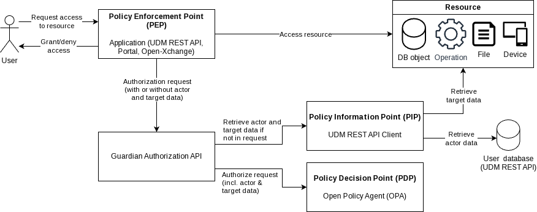
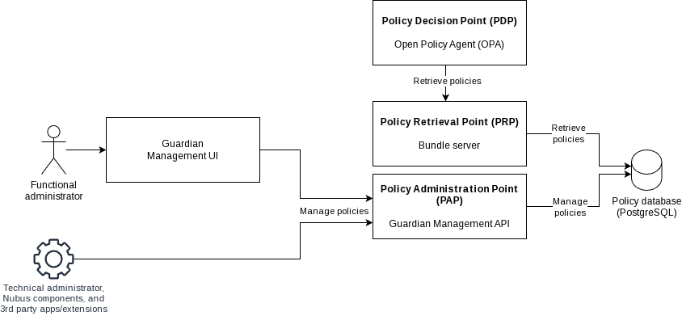
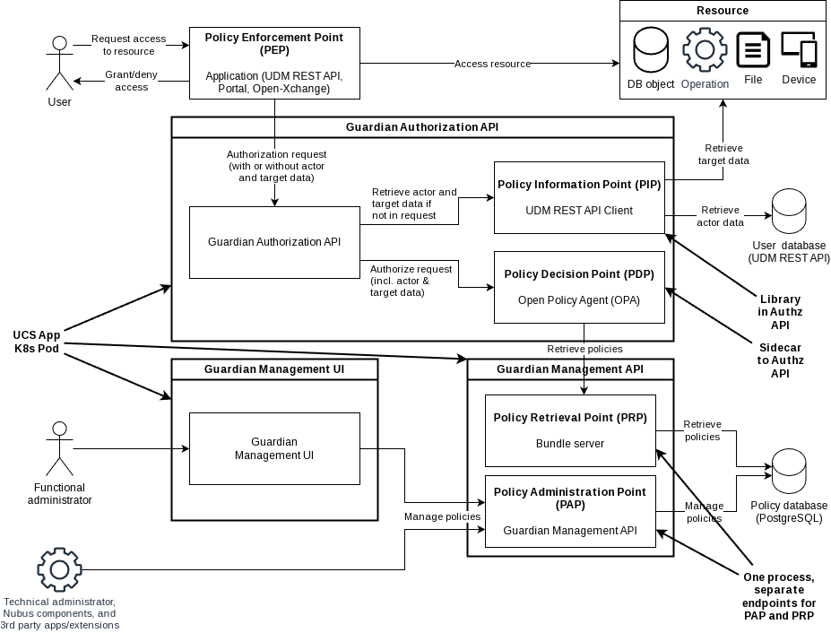

# Guardian ABAC System

The Guardian implements **Attribute-Based Access Control (ABAC)**
and is split into two cooperating APIs
plus two backing data stores:

- a **runtime authorization path**,
  which answers "may this actor perform this operation on this target?", and
- a **management path**,
  which lets administrators (and other systems) curate the policies that the runtime path evaluates.

The source diagrams live in [Guardian-ABAC-system.drawio](Guardian-ABAC-system.drawio)
(three pages: *Authorization*, *Management*, *Deployment*).
The exported PNGs are referenced inline below.

## Actors

- **User** — end user requesting access to a resource.
- **Functional administrator** — manages policies through the Guardian Management UI.
- **Technical administrator, Nubus components, and 3rd-party apps/extensions** —
  talk directly to the Guardian Management API, bypassing the UI.

## Authorization path

The authorization path is what the calling application invokes on every access decision.

1. The **User** sends a request to access a resource to the **Policy Enforcement Point (PEP)**.
   The PEP is the calling application itself (UDM REST API, Portal, Open-Xchange, …)
   and is the component that ultimately enforces *granting* or *denying* access to the resource.
2. The PEP forwards an *Authorization request* to the **Guardian Authorization API**,
   optionally preloaded with actor and target data
   if the application already has them in hand.
3. Inside the Authorization API:
   - The **Policy Information Point (PIP)** — a *UDM REST API Client* —
     fetches any **actor data** that was missing from the request
     from the **User database (UDM REST API)**,
     and any missing **target data** from the **Resource** itself.
   - The **Policy Decision Point (PDP)** — an **Open Policy Agent (OPA)** instance —
     receives the request enriched with actor and target data
     and produces the authorization decision.
4. Once the decision returns to the PEP,
   the PEP either performs the actual *access* call against the **resource**
   (a DB object, an operation, a file, or a device)
   or denies the request,
   and propagates *grant/deny* back to the User.

## Management path

The management path is what administrators and integrators use to author the policies that the PDP later evaluates.

1. The **functional administrator** uses the **Guardian Management UI**,
   which calls the **Guardian Management API** to *manage policies*.
   **Technical administrators**, **Nubus components**, and
   **3rd-party apps/extensions** call the Management API directly,
   without the UI.
2. Inside the Management API:
   - The **Policy Administration Point (PAP)** — the Guardian Management API itself —
     persists policies in the **Policy database (PostgreSQL)**.
   - The **Policy Retrieval Point (PRP)** — a *Bundle server* —
     reads those same policies back out of PostgreSQL
     and serves them as bundles to the PDP.
3. The **PDP (OPA)** in the Authorization API pulls policy bundles from the PRP,
   which is the only link between the two APIs at runtime.

## Deployment topology

The deployment view annotates the same components with how they are packaged and run:

- **Guardian Authorization API** ships as its own **UCS App / Kubernetes Pod**.
  - The **PIP** is a **library** linked into the Authorization API process —
    it is not a separate service.
  - The **PDP (OPA)** runs as a **sidecar** alongside the Authorization API
    in the same Pod,
    so the API talks to OPA over a private network.
- **Guardian Management API** and **Guardian Management UI** each ship as their own **UCS App / Kubernetes Pod**.
  - The Management API is **one process** that exposes **separate endpoints for the PAP and the PRP**;
    they share the same deployable unit but are addressed independently
    (admins write through the PAP endpoint;
    OPA pulls bundles through the PRP endpoint).
- The **User database (UDM REST API)** and the **Policy database (PostgreSQL)** are external to the Guardian deployment
  and are reached over the network.

## Summary

| Acronym | Role | Realized as |
|---------|------|-------------|
| PEP | Policy Enforcement Point | The calling application (UDM REST API, Portal, OX, …) |
| PIP | Policy Information Point | UDM REST API Client, library inside the Authorization API |
| PDP | Policy Decision Point | Open Policy Agent (OPA), sidecar to the Authorization API |
| PAP | Policy Administration Point | Guardian Management API endpoint |
| PRP | Policy Retrieval Point | Bundle server endpoint, same process as the PAP |
