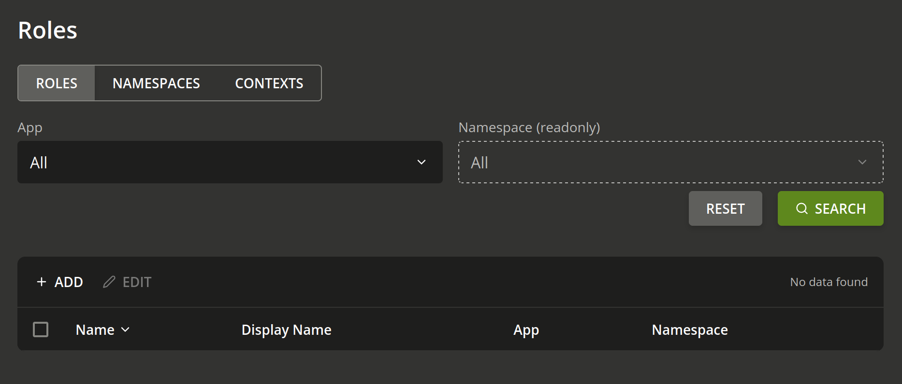

.. Copyright (C) 2023 Univention GmbH
..
.. SPDX-License-Identifier: AGPL-3.0-only

.. _management-ui:

*************
Management UI
*************

This chapter is geared towards :term:`Guardian administrators<guardian admin>` who want to
manage :term:`roles<role>` and related objects which can grant :term:`permissions<permission>` to users.

The Guardian :term:`Management UI` app provides a web interface to manage some of the features of the
REST API of the Guardian :term:`Management API` app.
The following sections describe which functions can be performed with the web interface.

You can access the :program:`Guardian Management UI` under
:samp:`https://[Domainname]/univention/guardian/management-ui`
for the :samp:`Domainname` where the :program:`Guardian Management UI` app is installed.
When installing the app, a portal entry is created in the *Administration* category of the default
domain portal (:samp:`cn=domain,cn=portal,cn=portals,cn=univention,$ldap_base`).
With the default configuration, a user who wants to use the :program:`Guardian Management UI` as a :term:`guardian admin`
needs the role ``guardian:builtin:super-admin``.

For a detailed explanation on what :term:`roles<role>`, :term:`capabilities<capability>`, :term:`namespaces<namespace>`
and :term:`contexts<context>` are, refer to the :ref:`section about terminology <guardian-terminology>`.

General remarks
===============

After you entered the :program:`Guardian Management UI`, you will see a navigation bar with the entries :guilabel:`ROLES`, :guilabel:`NAMESPACES` and :guilabel:`CONTEXTS`, a search bar with filters and a table.

   The front page of the :program:`Guardian Management UI`.

There are some differences, but you can view and manage the object types :term:`role`, :term:`namespace`, and :term:`context` by navigating between them with the navigation bar as described in the following sections.
The management of :term:`capabilities<capability>` is done while editing a role.

.. note::

   The :term:`apps<app>` in the *App* box can only be managed via the REST API provided by the
   :program:`Guardian Management API` app. Refer to :ref:`the developer quick start documentation<developer-quick-start>` if you need to integrate an app with the Guardian.

In the search view for one of the object types, you can filter by app and namespace, with the exception of namespaces themselves, which can only be filtered by app.

.. note::

   At the moment it is not possible to include properties of an object,
   such as its *Display Name*, in the search criteria.

.. _management-ui-roles:

Roles
=====

The :program:`Guardian Management UI` can be used to manage :term:`roles<role>`.
A role contains capabilities and is defined within the scope of an app and a namespace. From the role and its capabilities, permissions are derived. For more information about the fundamental concepts, refer to the :ref:`section about terminology<guardian-terminology>`.

.. _create-a-new-role:

Create a new role
-----------------

To create a new role first open the :program:`Guardian Management UI` and click on :guilabel:`ROLES` in the
navigation menu.

   Link to the roles page.

Then click on the :guilabel:`+ ADD` button to open the page to create a new role.

   Click :guilabel:`+ ADD` to create a new role.

The page to create a new role looks like this:

   Page to create a new role.

Fill out all the necessary fields and click on the :guilabel:`CREATE ROLE` button to create the role.
A pop-up will be shown which confirms the creation by displaying the role name.

.. note::

   The selectable options for the *Namespace* box depend on the selected app in the *App* box.
   You have to select an app first before you can select a namespace.
   If you selected an app and still don't see any selectable namespaces that means that
   there are no namespaces for that app. Refer to the :ref:`section about creating namespaces<create-a-new-namespace>`.

.. note::

   Capabilities for a role can only be managed on existing roles.
   To add capabilities to the role you are currently creating
   first create the role with the :guilabel:`CREATE ROLE` button
   and then manage capabilities as described in :ref:`capabilities-of-a-role`.

.. _listing-roles:

Listing and searching roles
---------------------------

To list existing roles open the "Guardian Management UI" and click on :guilabel:`ROLES` in the
navigation menu.

   Link to the "Roles" page.

On this page you can search for existing roles by clicking the :guilabel:`SEARCH` button.
The results will be shown below that button.
The search can be narrowed down by selecting a specific app in the *App* box, and
a namespace of the selected app in the *Namespace* box.

   Form elements for the search of roles.

.. note::

   The namespaces for the *Namespace* box can be managed as described in
   :ref:`namespaces`.

.. _editing-existing-roles:

Editing existing roles
----------------------

To edit a role, follow the steps in :ref:`listing-roles` to list them and then
click on the name of the role you want to edit.

   Edit button for listed roles.

The role editing is split into two pages.

The first page is to edit the direct properties of the role and is the
first page you see when opening a role.
This page can be accessed by clicking :guilabel:`ROLE` in the navigation menu.
Here you can edit the fields you want to change and click on :guilabel:`SAVE` to save the changes.

   View and edit page of an existing role.

The second page is to manage the capabilities of the current role. This page can be
visited by clicking on :guilabel:`CAPABILITES` in the navigation menu.

   Link to the "Capabilities" page of an existing role.

Here you can list all capabilities of the role you are currently editing and manage them.
You can also create new capabilities for that role or delete existing ones.
For more details on capabilities see the section: :ref:`capabilities-of-a-role`.

.. _deleting-roles:

Deleting roles
--------------

Deleting roles is not possible at the moment. Neither through the web-interface nor the REST API.

.. _capabilities-of-a-role:

Capabilities of a role
======================

:term:`Capabilities<capability>` serve as the means to manage the :term:`permissions<permission>` the :term:`role` will grant
to the user it is attached to.

Each capability object can define one ore more permissions it will grant.
These permissions can only be selected for a specific app and namespace.
If you want to grant permissions for different apps and/or namespaces you have
to create multiple capability objects.

Inside an capability object you can also add :term:`conditions<condition>` that influence whether
the permissions are actually granted.

The capabilities work on a whitelist principle and do not collide.

.. note::

   Capabilities can only be managed on existing roles.

   If you are creating a new role and want to manage its capabilities,
   first create the role and then edit the role to manage its capabilities.

.. _create-new-capabilities-for-a-role:

Create new capability for a role
--------------------------------

To add a capability for a role, first click on :guilabel:`CAPABILITES` in the navigation menu
while editing a role. See :ref:`editing-existing-roles` for more details
on editing a role.

Then click on the :guilabel:`+ ADD` button to open the page to create a new capability.

   Click :guilabel:`+ ADD` to create a new capability.

The page to create a new capability looks like this:

   Page to create a new capability.

To create the capability fill out all the necessary fields and then click the :guilabel:`CREATE CAPABILITY` button.
A pop-up will be shown which confirms the creation by displaying the capability name.

Three noteworthy fields are the list of *Permissions*, the list of *Conditions* and
the *Relation*.

Permissions
        In the *Permissions* list you can edit all permissions the capability will grant
        if the conditions in the *Conditions* list are met. The available permissions are based on
        the selected app in the *App* box and namespace in the *Namespace* box.
        You cannot select any permissions before filling out both of these fields.

.. note::

   If both the *App* box and *Namespace* box are filled out, and you still cannot
   select permissions, this means that no permissions exist for that app and namespace.

Conditions
        In the *Conditions* list you can edit all the conditions that should be checked
        before the permissions in the *Permissions* list are granted.
        Some conditions require additional parameters.
        You can look up more about these conditions in chapter :ref:`conditions`.
        Additional fields will be shown underneath them once selected.

   Condition with extra parameters.

.. note::

   See :ref:`conditions` for an explanation of the pre-existing conditions.

Relation
        The value of the *Relation* box describes how the
        :program:`Guardian Authorization API` will check conditions during authorization.
        :guilabel:`AND` means all conditions must be met and :guilabel:`OR` means only 1 condition must be met.

.. _listing-capabilities-of-a-role:

Listing and searching capabilities of a role
--------------------------------------------

To list capabilities of a role click on :guilabel:`CAPABILITES` in the navigation menu
while editing a role.
See :ref:`editing-existing-roles` for more details on editing a role.

On this page you can search for capabilities of the role you are currently editing by
clicking the :guilabel:`SEARCH` button. The results will be shown below that button.
The search can be narrowed down by selecting a specific app in the *App* box,
and a namespace of the selected app in the *Namespace* box.

   Form elements for the search of capabilities.

.. note::

   The namespaces for the *Namespace* box can be managed as described in
   :ref:`namespaces`.

.. _editing-a-capability-of-a-role:

Edit a capability of a role
---------------------------

To edit a capability of a role, follow the steps in :ref:`listing-capabilities-of-a-role`
to list them and then click on the name of the capability you want to edit.

   Edit button for listed capabilities.

The page to edit the clicked capability looks like this:

   View and edit page of an existing capability.

The three noteworthy fields you can edit are the list of *Conditions*, the *Relation* and
the list of *Permissions*.

Permissions
        In the *Permissions* list you can edit all permissions the capability will grant
        if the conditions in the *Conditions* list are met.

Conditions
        In the *Conditions* list you can edit all the conditions that should be checked
        before the permissions in the *Permissions* list are granted.
        Some conditions require additional parameters.
        Additional fields will be shown underneath them once selected.

   Condition with extra parameters.

.. note::

   See :ref:`conditions` for an explanation of the pre-existing conditions.

Relation
        The value of the *Relation* box describes in which manner the selected
        conditions of the *Conditions* should be checked.
        :guilabel:`AND` means all conditions have to be met, :guilabel:`OR` means only 1 condition has to be met.

.. _deleting-capabilities-of-a-role:

Delete capabilities of a role
-----------------------------

To delete capabilities, first click on :guilabel:`CAPABILITES` in the navigation menu
while editing a role. See :ref:`editing-existing-roles` for more details on editing a role.

Search and select all the capabilities you want to delete, then click the :guilabel:`DELETE` button.

   Deletion of capabilities.

.. _namespaces:

Namespaces
==========

A namespace is a means to categorize roles and permissions. With the :program:`Guardian Management UI` namespaces can be created, edited, searched and viewed. For more information about namespaces refer to the :ref:`section about Guardian terminology<guardian-terminology>`.

.. _create-a-new-namespace:

Create a new namespace
----------------------

To create a new namespace first open the :program:`Guardian Management UI` and click on :guilabel:`NAMESPACES` in the
navigation menu.

   Link to the "Namespaces" page.

Then click on the :guilabel:`+ ADD` button to open the page to create a new namespace.

   Click :guilabel:`+ ADD` to create a new namespace.

The page to create a new namespace looks like this:

   Page to create a new namespace.

Fill out all the necessary fields and click on the :guilabel:`CREATE NAMESPACE` button to create the namespace.
A pop-up will be shown which confirms the creation by displaying the namespace name.

.. _listing-namespaces:

Listing and searching namespaces
--------------------------------

To list existing namespaces open the :program:`Guardian Management UI` and click on :guilabel:`NAMESPACES` in the
navigation menu.

   Link to the "Namespaces" page.

On this page you can search for existing namespaces by clicking the :guilabel:`SEARCH` button.
The results will be shown below that button.
The search can be narrowed down by selecting a specific app in the *App* box.

   Form elements for the search of namespaces.

.. _editing_existing_namespaces:

Editing existing namespaces
---------------------------

To edit a namespaces, follow the steps in :ref:`listing-namespaces`
to list them and then click on the name of the namespace you want to edit.

   Edit button for listed namespaces.

The page to edit the namespace you clicked looks like this:

   View and edit page of an existing namespace.

.. _deleting-namespaces:

Deleting namespaces
-------------------

Deleting namespaces is not possible at the moment. Neither through the web-interface nor the REST API.

.. _management-ui-contexts:

Contexts
========

A context is an additional tag that can be applied to a :term:`role`, to make
it only apply in certain circumstances.
With the :program:`Guardian Management UI` you can create, edit, search and view a context.
For more information about contexts refer to the :ref:`section about Guardian terminology<guardian-terminology>`.

.. _create-a-new-context:

Create a new context
--------------------

To create a new context first open the :program:`Guardian Management UI` and click on :guilabel:`CONTEXTS` in the
navigation menu.

   Link to the "Namespaces" page.

Then click on the :guilabel:`ADD` button to open the page to create a new context.

   Click :guilabel:`+ ADD` to create a new context.

The page to create a new context looks like this:

   Page to create a new context.

Fill out all the necessary fields and click on the :guilabel:`CREATE CONTEXT` button to create the context.
A pop-up will be shown which confirms the creation by displaying the context name.

.. _listing-contexts:

Listing and searching contexts
------------------------------

To list existing contexts open the :program:`Guardian Management UI` and click on :guilabel:`CONTEXTS` in the
navigation menu.

   Link to the "Contexts" page.

On this page you can search for existing contexts by clicking the :guilabel:`SEARCH` button.
The results will be shown below that button.
The search can be narrowed down by selecting a specific app in the *App* box,
and a namespace of the selected app in the *Namespace* box.

   Form elements for the search of contexts.

.. note::

   The namespaces for the *Namespace* box can be managed as described in
   :ref:`namespaces`.

.. _editing-existing-contexts:

Editing existing contexts
-------------------------

To edit a context, follow the steps in :ref:`listing-contexts`
to list them and then click on the name of the context you want to edit.

   Edit button for listed contexts.

The page to edit the context you clicked looks like this:

   View and edit page of an existing context.

.. _deleting-contexts:

Deleting contexts
-----------------

Deleting contexts is not possible at the moment. Neither through the web-interface nor the REST API.
